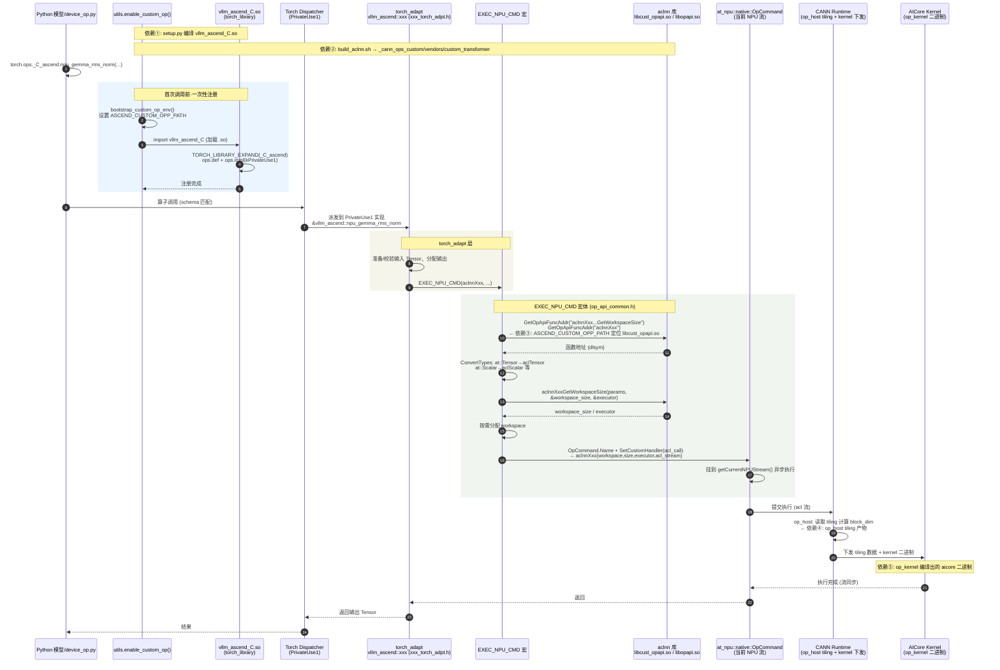
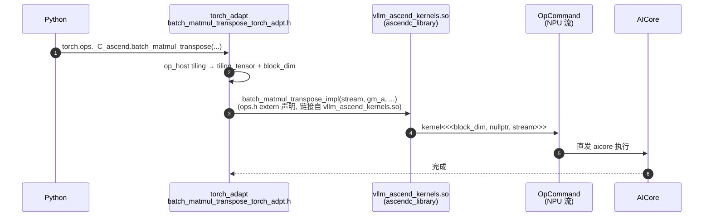
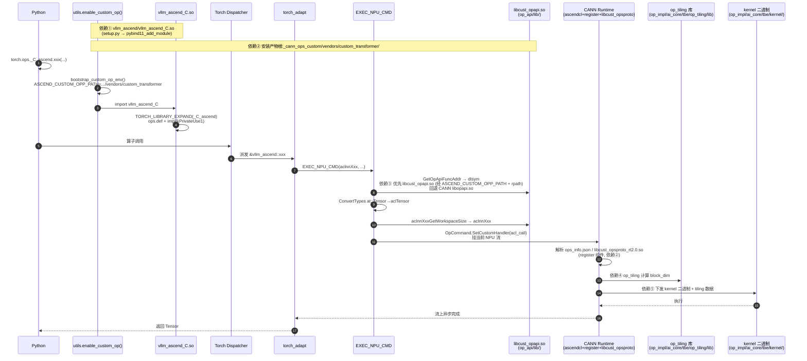
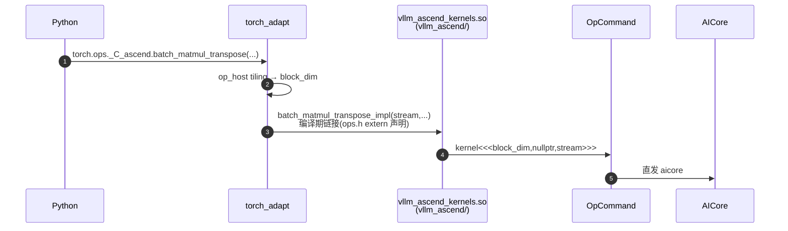

# VLLM Ascend 算子编译框架分析


本文档系统梳理 vllm-ascend `csrc` 目录下的算子编译框架与调用链，内容包括：两套独立的编译体系、完整的算子调用链（Python 注册 → torch_adapt → EXEC_NPU_CMD → aclnn → kernel）、各依赖对应的编译产物（.so）与 CMakeLists 链接顺序、接入新算子的完整步骤与骨架代码、跨目录/跨 CANN/外部库引用方式、以源码覆盖 CANN 内置算子的机制，以及基于远程环境实测的各 .so 导出接口验证。

---

## 1. 整体架构：两条独立编译链

vllm-ascend 的 `csrc` 包含**两套独立的编译体系**：

1. **CANN 自定义算子包**：生成 kernel / aclnn 接口库
2. **torch C++ 扩展**：生成 pybind 模块

### 1.1 链条 1：CANN 自定义算子包（ACLNN + Kernel）

- 入口：[build_aclnn.sh](file:///d:/Project/MyCode/vllm-ascend/csrc/build_aclnn.sh)，内部调 [build.sh](file:///d:/Project/MyCode/vllm-ascend/csrc/build.sh) `--pkg --ops=... --soc=...`，由 [csrc/CMakeLists.txt](file:///d:/Project/MyCode/vllm-ascend/csrc/CMakeLists.txt)（`project(cann_ops-transformer)`）驱动。
- 每个算子目录的标准结构（以 [attention/compressor](file:///d:/Project/MyCode/vllm-ascend/csrc/attention/compressor) 为例）：

```
op_host/    →  tiling（CPU 侧） + *_def.cpp（算子定义）
op_kernel/  →  AscendC kernel（编译成 aicore 二进制）
CMakeLists.txt
```

- `op_host/CMakeLists.txt` 里的 `add_op_to_compiled_list()` / `add_modules_sources(OPTYPE xxx ACLNNTYPE aclnn)` / `add_tiling_modules()` 都是 CANN 提供的宏（[obj_func.cmake](file:///d:/Project/MyCode/vllm-ascend/csrc/cmake/obj_func.cmake)、[opbuild.cmake](file:///d:/Project/MyCode/vllm-ascend/csrc/cmake/opbuild.cmake)），负责把 tiling/kernel 注册进编译清单。
- 依赖：CANN 的 `ASCEND_HOME_PATH`、tikcpp `ascendc_kernel_cmake`、`Find*.cmake`（[cmake/modules](file:///d:/Project/MyCode/vllm-ascend/csrc/cmake/modules)）以及 catlass 子模块（[build_aclnn.sh](file:///d:/Project/MyCode/vllm-ascend/csrc/build_aclnn.sh#L17-L35) 先 `setup_catlass_dependency`）。
- 产物：打包成 `cann-ops-transformer*.run` 自解压包，安装到 [vllm_ascend/_cann_ops_custom](file:///d:/Project/MyCode/vllm-ascend/vllm_ascend/_cann_ops_custom)（见 [build_aclnn.sh](file:///d:/Project/MyCode/vllm-ascend/csrc/build_aclnn.sh#L268-L287)）。

### 1.2 链条 2：torch C++ 扩展（Pybind 模块）

- 入口：[setup.py](file:///d:/Project/MyCode/vllm-ascend/setup.py) 定义 `CMakeExtension(name="vllm_ascend.vllm_ascend_C")`，由顶层 [CMakeLists.txt](file:///d:/Project/MyCode/vllm-ascend/CMakeLists.txt)（`project(vllm_ascend_C)`）驱动。
- `find_package(pybind11)` / `find_package(Torch)`（强校验 torch==2.10.0）。
- `pybind11_add_module(vllm_ascend_C ${VLLM_ASCEND_SRC})`，源文件 glob 自 `csrc/*.cpp` + `csrc/aclnn_torch_adapter/*.cpp`（见 [CMakeLists.txt](file:///d:/Project/MyCode/vllm-ascend/CMakeLists.txt#L108-L113)）。
- 链接：`torch_npu`、`ascendcl`、`opapi`、`register`、`platform` 等（[CMakeLists.txt](file:///d:/Project/MyCode/vllm-ascend/CMakeLists.txt#L171-L181)）。
- rpath 指向 `_cann_ops_custom/vendors/custom_transformer/op_api/lib`，保证运行时能动态加载自定义 opapi 库。

### 1.3 编译顺序

`pip install -e .` 时 [build_ext.run()](file:///d:/Project/MyCode/vllm-ascend/setup.py#L411-L420) 的先后顺序：

1. **先跑 `build_aclnn` 命令** → 编译链条 1（CANN 算子包），生成 `_cann_ops_custom`
2. **再跑 cmake build_ext** → 配置并编译链条 2（`vllm_ascend_C` + 可选的 `vllm_ascend_kernels`），`cmake --install` 装 `.so` 到 `vllm_ascend/`
3. editable 模式下把所有 `.so` copy 回 `vllm_ascend/`，并把 `_cann_ops_custom` 目录拷进 build 目录（[setup.py](file:///d:/Project/MyCode/vllm-ascend/setup.py#L392-L409)）

### 1.4 依赖来源汇总

| 依赖 | 来源 |
|---|---|
| pybind11 | pip（`-m pybind11 --cmakedir`） |
| torch/torch_npu | pip 安装路径、`TORCH_NPU_PATH` |
| CANN（acl/opapi/tikcpp） | `ASCEND_HOME_PATH`（[setup.py](file:///d:/Project/MyCode/vllm-ascend/setup.py#L277-L282)） |
| catlass | git submodule |
| SOC 信息 | `npu-smi` 自动探测或 `SOC_VERSION` 环境变量（[setup.py](file:///d:/Project/MyCode/vllm-ascend/setup.py#L79-L93)） |

---

## 2. 算子调用链

### 2.1 ACLNN 路径完整调用链（时序图）

以 `npu_gemma_rms_norm` 为例，完整链路：



### 2.2 各环节说明

**1. Python 侧注册（懒加载）**

[vllm_ascend/utils.py](file:///d:/Project/MyCode/vllm-ascend/vllm_ascend/utils.py#L398-L440) 的 `enable_custom_op()`：
- `bootstrap_custom_op_env()` 把 `_cann_ops_custom/vendors/custom_transformer` 加进 `ASCEND_CUSTOM_OPP_PATH`（[utils.py](file:///d:/Project/MyCode/vllm-ascend/vllm_ascend/utils.py#L307-L318)）
- `import vllm_ascend.vllm_ascend_C` → 加载 `vllm_ascend_C.so`，触发下面的 C++ 注册

**2. C++ 注册点（TORCH_LIBRARY）**

[torch_binding.cpp](file:///d:/Project/MyCode/vllm-ascend/csrc/torch_binding.cpp#L1899-L1903)：

```cpp
TORCH_LIBRARY_EXPAND(CONCAT(_C, _ascend), ops) {
    ops.def("npu_gemma_rms_norm(...) -> (Tensor y, Tensor rstd)");
    ops.impl("npu_gemma_rms_norm", torch::kPrivateUse1, &vllm_ascend::npu_gemma_rms_norm);
    ...
}
```

- `CONCAT(_C, _ascend)` 展开为 `_C_ascend`（宏定义在 [utils.h](file:///d:/Project/MyCode/vllm-ascend/csrc/utils.h#L13-L20)），所以 Python 侧命名空间是 `torch.ops._C_ascend.*`
- 用 `torch::kPrivateUse1` 注册到 PrivateUse1 派发键

**3. Python 侧调用**：`torch.ops._C_ascend.npu_gemma_rms_norm(...)`（如 [device_op.py](file:///d:/Project/MyCode/vllm-ascend/vllm_ascend/device/device_op.py#L148) 这类）

**4. torch_adapt（具体实现函数）**

每个算子的实现放在 `*_torch_adpt.h` 里，`vllm_ascend::npu_gemma_rms_norm` 内部最终走到：

```cpp
EXEC_NPU_CMD(aclnnXxx, ...);   // 见 k2q_csr_torch_adpt.h 的多个调用
```

**5. EXEC_NPU_CMD 宏**（[op_api_common.h](file:///d:/Project/MyCode/vllm-ascend/csrc/aclnn_torch_adapter/op_api_common.h#L687-L752)）做的事：

1. `GetOpApiFuncAddr("aclnnXxxGetWorkspaceSize"/"aclnnXxx")` **运行时 dlsym 动态加载**（[op_api_common.h](file:///d:/Project/MyCode/vllm-ascend/csrc/aclnn_torch_adapter/op_api_common.h#L274-L315)），优先从 `ASCEND_CUSTOM_OPP_PATH` 下的 `libcust_opapi.so`（自定义算子包），回退到 CANN 的 `libopapi.so`
2. `ConvertTypes(...)` 把 `at::Tensor`/`at::Scalar` 等转成 `aclTensor*`/`aclScalar*`（acl 句柄）
3. 调 `aclnnXxxGetWorkspaceSize(..., &workspace_size, &executor)` 拿到 workspace 大小
4. 按需分配 workspace，构造 `acl_call` lambda：调 `aclnnXxx(workspace_addr, workspace_size, executor, acl_stream)`
5. 通过 `at_npu::native::OpCommand` 的 `SetCustomHandler(acl_call)` 把调用挂到当前 NPU 流（`c10_npu::getCurrentNPUStream()`）上异步执行

**6. aclnn → kernel**

`aclnnXxx`（`libcust_opapi.so`）按 CANN 框架走：op_host 侧 tiling 计算 → 运行时把 tiling 数据 + kernel 二进制（op_kernel 产物）下发到 aicore 执行。

### 2.3 kernel 直调路径（不经过 aclnn）

只对非 310P / 非 950 编译（`-DVLLM_ENABLE_ATB_AND_DIRECT_KERNELS`，见 [CMakeLists.txt](file:///d:/Project/MyCode/vllm-ascend/CMakeLists.txt#L161-L166)），例如 `batch_matmul_transpose`、`mla_preprocess`、bgmv/sgmv。

编译侧：

```cmake
ascendc_library(vllm_ascend_kernels SHARED ${VLLM_ASCEND_CUSTOM_OP})
```

`csrc/batch_matmul_transpose/op_kernel/batch_matmul_transpose_kernel.cpp` 等被编成 `vllm_ascend_kernels.so`（见 [CMakeLists.txt](file:///d:/Project/MyCode/vllm-ascend/CMakeLists.txt#L72-L95)），`vllm_ascend_C` 链接它。

调用侧（[batch_matmul_transpose_torch_adpt.h](file:///d:/Project/MyCode/vllm-ascend/csrc/batch_matmul_transpose/batch_matmul_transpose_torch_adpt.h#L28-L52)）：

1. op_host 的 tiling 函数在 CPU 算好 `tiling_tensor` + `block_dim`
2. 直接调 `batch_matmul_transpose_impl(stream, gm_a, ...)` —— 这是 `vllm_ascend_kernels.so` 导出的符号（声明在 [ops.h](file:///d:/Project/MyCode/vllm-ascend/csrc/ops.h#L120-L134)）
3. 内部就是 AscendC kernel launch：

```cpp
batch_matmul_transpose<<<block_dim, nullptr, stream>>>(gm_a, gm_b, gm_c, gm_tiling_data);
```

（[batch_matmul_transpose_kernel.cpp](file:///d:/Project/MyCode/vllm-ascend/csrc/batch_matmul_transpose/op_kernel/batch_matmul_transpose_kernel.cpp#L810-L823)），同样经 `OpCommand.SetCustomHandler` 挂到 NPU 流。



**两条链路最终都通过 `at_npu::native::OpCommand.SetCustomHandler()` 挂到当前 NPU 流上异步执行**；区别只在中间那一段：aclnn 路径由 CANN 的 op_host/op_kernel 框架托管，直调路径则是显式调 kernel launch + 自算 tiling。

---

## 3. 编译产物与依赖对应关系

### 3.1 产物路径总览

依赖②（`build_aclnn.sh` 产物）安装到 `vllm_ascend/_cann_ops_custom/vendors/custom_transformer/`，目录结构由 [config.cmake](file:///d:/Project/MyCode/vllm-ascend/csrc/cmake/config.cmake#L74-L77)、[custom_build.cmake](file:///d:/Project/MyCode/vllm-ascend/csrc/cmake/custom_build.cmake#L118)、[func.cmake](file:///d:/Project/MyCode/vllm-ascend/csrc/cmake/func.cmake#L455-L457) 决定：

```
_vllm_ascend_C 相关
├── vllm_ascend/vllm_ascend_C.so          ← 依赖①（链条2 主产物）
└── vllm_ascend/vllm_ascend_kernels.so    ← 链条2a（直调 kernel，A2/A3）

_cann_ops_custom/vendors/custom_transformer/   ← 依赖②（链条1 产物）
├── op_api/lib/libcust_opapi.so           ← 依赖③：aclnn host 接口库（运行时 dlsym）
├── op_api/include/aclnnop/               ← aclnn 声明头（gen_aclnn 生成）
├── op_proto/lib/linux/<arch>/libcust_opsproto_rt2.0.so
├── op_impl/ai_core/tbe/op_tiling/lib/... ← 依赖④：op_host tiling 库
├── op_impl/ai_core/tbe/kernel/<soc>/     ← 依赖⑤：kernel 二进制（.o，aicore 可执行）
├── op_impl/ai_core/tbe/config/<compute_unit>/   ← ops_info.json（算子注册表）
└── scripts/
```

### 3.2 CMakeLists 中的链接顺序（链条 2）

顶层 [CMakeLists.txt](file:///d:/Project/MyCode/vllm-ascend/CMakeLists.txt#L172-L181) 中 `vllm_ascend_C` 的链接顺序：

```cmake
set(VLLM_ASCEND_C_COMMON_LIBS
  ${TORCH_LIBRARIES}   # ① libtorch/libtorch_cpu（PyTorch 2.10）
  torch_npu            #   torch_npu 扩展（OpCommand/NPUStream/PrivateUse1）
  ascendcl             #   acl 运行时（aclrtStream）
  tiling_api           #   ④ tiling 计算所需接口
  register             #   算子注册表（加载 op_proto/ops_info）
  platform
  ascendalog
  dl                   #   ③ dlopen/dlsym 依赖
  opapi                #   ③ CANN 内置 libopapi.so（回退）
)

target_link_libraries(vllm_ascend_C PUBLIC
  vllm_ascend_kernels   # 链条2a：直调 kernel 库
  ${VLLM_ASCEND_C_COMMON_LIBS}
)
```

运行时查找顺序（rpath，[CMakeLists.txt](file:///d:/Project/MyCode/vllm-ascend/CMakeLists.txt#L198)）：

```
-Wl,-rpath,$ORIGIN:$ORIGIN/lib:$ORIGIN/_cann_ops_custom/vendors/custom_transformer/op_api/lib
```

### 3.3 依赖①~⑤ 标注版时序图



**kernel 直调分支**（依赖①的姊妹产物，链条2a）：



### 3.4 依赖与产物的对应关系表

| # | 具体产物（路径） | 编译位置 | 加载方式 |
|---|---|---|---|
| ① | `vllm_ascend/vllm_ascend_C.so` | [setup.py](file:///d:/Project/MyCode/vllm-ascend/setup.py#L434-L436) → [CMakeLists.txt](file:///d:/Project/MyCode/vllm-ascend/CMakeLists.txt#L116) | Python `import` |
| ② | `vllm_ascend/_cann_ops_custom/vendors/custom_transformer/`（整体） | [build_aclnn.sh](file:///d:/Project/MyCode/vllm-ascend/csrc/build_aclnn.sh#L268-L287) → [csrc/CMakeLists.txt](file:///d:/Project/MyCode/vllm-ascend/csrc/CMakeLists.txt) | `build_ext` 前序执行，装进包 |
| ③ | `.../op_api/lib/libcust_opapi.so`（自定义）/ CANN `libopapi.so`（回退） | 链条1 | 运行时 `dlsym`（[GetOpApiFuncAddr](file:///d:/Project/MyCode/vllm-ascend/csrc/aclnn_torch_adapter/op_api_common.h#L274-L315)），非编译期链接 |
| ④ | `.../op_impl/ai_core/tbe/op_tiling/lib/...` | 每个算子 `op_host/`（tiling） | CANN Runtime 经 `register` 组件按需 dlopen |
| ⑤ | `.../op_impl/ai_core/tbe/kernel/<soc>/...`（aicore 二进制） | 每个算子 `op_kernel/`（[func.cmake](file:///d:/Project/MyCode/vllm-ascend/csrc/cmake/func.cmake#L455-L457)） | CANN Runtime 按 `ops_info.json` 加载下发 |

> **关键点**：只有 ① 和 `vllm_ascend_kernels.so`（直调分支）是**编译期链接**；③④⑤ 都是**运行时解析**——③ 由 `vllm_ascend_C` 自己 dlsym，④⑤ 由 CANN Runtime 解析（经 `register` + `libcust_opsproto` + `ops_info.json`）。

---

## 4. 接入新算子指南

接入一个走 `EXEC_NPU_CMD` → aclnn 的算子，要动**两条编译链 + 注册 + Python 入口**。先分清两种场景：

- **场景 A（自定义算子）**：aclnn 接口来自 vllm-ascend 自定义算子包 → 需要写 `op_host/op_kernel` + 加进 build 列表（如 k2q_csr_hist）
- **场景 B（CANN 内置 aclnn）**：aclnn 接口 CANN 已提供 → 只需写 torch_adapt + 注册（`chunk_fwd_o` → `aclnnChunkFwdO` 就是这种，csrc 里没有对应算子目录）

下面按场景 A 为主线（完整接入），场景 B 只走第 4~6 步。

### 4.1 步骤 1：CANN 算子侧 — 建目录（场景 A）

参考 [k2q_csr/k2q_csr_hist](file:///d:/Project/MyCode/vllm-ascend/csrc/attention/k2q_csr/k2q_csr_hist) 的标准结构，新建 `csrc/<模块>/<op_name>/`：

```
<op_name>/
├── CMakeLists.txt                    # 入口，include 子目录
├── op_host/
│   ├── CMakeLists.txt                # add_op_to_compiled_list / add_tiling_modules
│   ├── <op>_def.cpp                  # 算子定义（输入/输出/属性声明，REG_OP）
│   ├── <op>_infershape.cpp           # 输出 shape 推导（InferShape）
│   └── <op>_tiling.cpp               # tiling：算 block_dim/tiling 数据（CPU 侧）
└── op_kernel/
    ├── CMakeLists.txt                # 声明 kernel 源文件
    └── <op>.cpp                      # AscendC kernel（宏加 KernelLaunch）
```

写完后，该算子的 `aclnn<OpName>` 接口就由编译链 1 生成进 `libcust_opapi.so`（依赖③），kernel/tiling 会进依赖④⑤。

### 4.2 步骤 2：加进 CANN 编译列表（场景 A）

在 [build_aclnn.sh](file:///d:/Project/MyCode/vllm-ascend/csrc/build_aclnn.sh#L72-L105) 里对应 SOC 分支的 `CUSTOM_OPS_ARRAY` 加入 op 名（注意算子的目录名要和这里一致，`resolve_op_dir` 会去 `moe/gmm/attention/mc2/ffn/posembedding` 下找）：

```bash
CUSTOM_OPS_ARRAY=(
    ...
    "my_new_op"
)
```

> `--ops="..."` 最终传给 [csrc/CMakeLists.txt](file:///d:/Project/MyCode/vllm-ascend/csrc/CMakeLists.txt)（`ASCEND_OP_NAME`），由 [func.cmake](file:///d:/Project/MyCode/vllm-ascend/csrc/cmake/func.cmake#L113-L119) 过滤哪些 op 参与编译。

### 4.3 步骤 3：torch_adapt — 写 C++ 实现函数

在 `torch_binding.cpp` 里（或独立 `xxx_torch_adpt.h` 如 [k2q_csr_torch_adpt.h](file:///d:/Project/MyCode/vllm-ascend/csrc/attention/k2q_csr/k2q_csr_torch_adpt.h)，再在 torch_binding.cpp 里 `#include`）定义 `vllm_ascend::xxx`，内部就是**准备 Tensor → EXEC_NPU_CMD**，参考 [chunk_fwd_o](file:///d:/Project/MyCode/vllm-ascend/csrc/torch_binding.cpp#L1854-L1877)：

```cpp
at::Tensor my_op(const at::Tensor& x, ...) {
    at::Tensor y = at::zeros(..., x.options());        // 预分配输出
    EXEC_NPU_CMD(
        aclnnMyOp,                                     // aclnn 接口名（编译链1生成）
        x, ..., y                                      // 参数与 aclnn 签名一致
    );
    return y;
}
```

`EXEC_NPU_CMD` 会自动完成 dlsym 加载 `aclnnMyOp` + `ConvertTypes` 类型转换 + workspace 分配 + 挂当前 NPU 流（详见 2.2 节）。

### 4.4 步骤 4：TORCH_LIBRARY 注册

在 [torch_binding.cpp](file:///d:/Project/MyCode/vllm-ascend/csrc/torch_binding.cpp#L1899-L1937) 的 `TORCH_LIBRARY_EXPAND(CONCAT(_C, _ascend), ops)` 里加两行：

```cpp
ops.def("my_op(Tensor x, ..., int? opt=None) -> Tensor");       // schema，和 Python 调用一致
ops.impl("my_op", torch::kPrivateUse1, &vllm_ascend::my_op);    // 派发到 NPU
```

> 注意：310P 分支（`#ifdef ASCEND_PLATFORM_310P`）和正常分支（文件末尾）各有**一份** `TORCH_LIBRARY`，都要加（如 [chunk_fwd_o 两处注册](file:///d:/Project/MyCode/vllm-ascend/csrc/torch_binding.cpp#L1935-L1937) 和 [L2540-L2542](file:///d:/Project/MyCode/vllm-ascend/csrc/torch_binding.cpp#L2540-L2542)）。

### 4.5 步骤 5：Python 侧入口

模型代码里直接用 `torch.ops._C_ascend.my_op(...)`（见 [sfa_v1.py](file:///d:/Project/MyCode/vllm-ascend/vllm_ascend/attention/sfa_v1.py#L911) 的调用方式）。若想加一层 Python 封装，放到 `vllm_ascend/ops/` 下统一管理。

### 4.6 步骤 6：可选 — Meta 注册

如需要 `torch.compile`/图模式，在 [torch_binding_meta.cpp](file:///d:/Project/MyCode/vllm-ascend/csrc/torch_binding_meta.cpp#L1497-L1511) 加 `TORCH_LIBRARY_IMPL_EXPAND(_C_ascend, Meta, ...)` 输出 shape 推导，或在 [meta_registration.py](file:///d:/Project/MyCode/vllm-ascend/vllm_ascend/meta_registration.py) 里用 Python 注册。

### 4.7 编译验证流程

```bash
# 1. 先确认 CANN 算子能单独编译（省时，重点调试 kernel/tiling）
cd vllm-ascend && bash csrc/build.sh --pkg --ops=my_new_op --soc=ascend910b
# 2. 全量安装（会先跑 build_aclnn 再编 vllm_ascend_C）
pip install -e . --no-build-isolation
# 3. 单算子验证
python tests/test_my_op.py   # 新算子 vs torch 参考 vs 旧实现 三方对比
```

### 4.8 接入检查清单（对照依赖①~⑤）

- [ ] op_host `_def.cpp` 声明了完整的输入/输出/属性（决定 `aclnnMyOp` 签名）
- [ ] `op_kernel` 编译通过、`CUSTOM_OPS` 列表已加（依赖④⑤）
- [ ] `EXEC_NPU_CMD(aclnnMyOp, ...)` 参数顺序与 aclnn 签名一致（依赖③，写错会 dlsym 找不到符号或参数不匹配）
- [ ] `ops.def` 的 schema 与 Python 实参、与 C++ 函数签名三者一致
- [ ] 310P + 正常分支两处都注册了
- [ ] `enable_custom_op()` 已 import（Python 侧加载 `.so` 的入口）

---

## 5. 示例：chunk_fwd_o 骨架代码

以 chunk_fwd_o 为模板的 op_host 骨架。目录建议放 `csrc/attention/chunk_fwd_o/`（build_aclnn.sh 310P 分支已引用该名字）。

> 接口依据是 [chunk_fwd_o 的 EXEC_NPU_CMD](file:///d:/Project/MyCode/vllm-ascend/csrc/torch_binding.cpp#L1854-L1877) 调用：`aclnnChunkFwdO(q, k, v, h, g, cu_seqlens, chunk_indices, scale, chunk_size, o)`。即输入 q/k/v/h + 可选 g，可选 list 属性 cu_seqlens/chunk_indices，标量 scale/chunk_size，输出 o。

### 5.1 `op_host/chunk_fwd_o_def.cpp`

```cpp
/**
 * ChunkFwdO 算子定义（vllm-ascend 自定义算子）。
 * 输入: q, k, v, h, g(可选)
 * 属性: cu_seqlens(可选list), chunk_indices(可选list), scale, chunk_size
 * 输出: o
 * 说明: aclnn 接口名由 OPTYPE(chunk_fwd_o)+ACLNNTYPE(aclnn) 生成 -> aclnnChunkFwdO
 */
#include "register/op_def_registry.h"

namespace ops {

class ChunkFwdO : public OpDef {
public:
    explicit ChunkFwdO(const char *name) : OpDef(name)
    {
        // q/k/v: [T, H, D]（NF16/FP32 按需增删）
        this->Input("q")
            .ParamType(REQUIRED)
            .DataTypeList({ge::DT_FLOAT16, ge::DT_FLOAT})
            .FormatList({ge::FORMAT_ND})
            .UnknownShapeFormat({ge::FORMAT_ND})
            .AutoContiguous();
        this->Input("k")
            .ParamType(REQUIRED)
            .DataTypeList({ge::DT_FLOAT16, ge::DT_FLOAT})
            .FormatList({ge::FORMAT_ND})
            .UnknownShapeFormat({ge::FORMAT_ND})
            .AutoContiguous();
        this->Input("v")
            .ParamType(REQUIRED)
            .DataTypeList({ge::DT_FLOAT16, ge::DT_FLOAT})
            .FormatList({ge::FORMAT_ND})
            .UnknownShapeFormat({ge::FORMAT_ND})
            .AutoContiguous();
        // h: 状态张量（shape 依 kernel 设计，如 [B, HV, K, V]，通常 FP32）
        this->Input("h")
            .ParamType(REQUIRED)
            .DataType({ge::DT_FLOAT})
            .Format({ge::FORMAT_ND})
            .UnknownShapeFormat({ge::FORMAT_ND})
            .AutoContiguous();
        // g: 可选 gate
        this->Input("g")
            .ParamType(OPTIONAL)
            .DataTypeList({ge::DT_FLOAT16, ge::DT_FLOAT})
            .FormatList({ge::FORMAT_ND})
            .UnknownShapeFormat({ge::FORMAT_ND})
            .AutoContiguous();

        this->Output("o")
            .ParamType(REQUIRED)
            .DataTypeList({ge::DT_FLOAT16, ge::DT_FLOAT})
            .FormatList({ge::FORMAT_ND})
            .UnknownShapeFormat({ge::FORMAT_ND})
            .AutoContiguous();

        // 属性顺序与 EXEC_NPU_CMD 传参顺序一致（索引 0~3 供 tiling 读取）
        this->Attr("cu_seqlens").AttrType(OPTIONAL).ListInt();      // idx0
        this->Attr("chunk_indices").AttrType(OPTIONAL).ListInt();   // idx1
        this->Attr("scale").AttrType(REQUIRED).Float(1.0f);         // idx2
        this->Attr("chunk_size").AttrType(OPTIONAL).Int(64);        // idx3

        OpAICoreConfig aicoreConfig;
        aicoreConfig.DynamicCompileStaticFlag(true)
            .DynamicFormatFlag(false)
            .DynamicRankSupportFlag(true)
            .DynamicShapeSupportFlag(true)
            .NeedCheckSupportFlag(false)
            .PrecisionReduceFlag(true)
            .ExtendCfgInfo("opFile.value", "chunk_fwd_o");   // 对应 op_kernel/chunk_fwd_o.cpp
        this->AICore().AddConfig("ascend910b", aicoreConfig);
        this->AICore().AddConfig("ascend910_93", aicoreConfig);

        // 若需在 A3 用独立的 APT kernel（如 k2q_csr 的 _apt 模式），再加一份：
        // OpAICoreConfig a5Config;
        // a5Config.DynamicCompileStaticFlag(true)
        //     .DynamicFormatFlag(false)
        //     .DynamicRankSupportFlag(true)
        //     .DynamicShapeSupportFlag(true)
        //     .NeedCheckSupportFlag(false)
        //     .PrecisionReduceFlag(true)
        //     .ExtendCfgInfo("opFile.value", "chunk_fwd_o_apt");
        // this->AICore().AddConfig("ascend950", a5Config);
    }
};
OP_ADD(ChunkFwdO);
} // namespace ops
```

### 5.2 `op_host/chunk_fwd_o_tiling.cpp`

配套的 tiling 数据结构和定义放 `op_kernel/chunk_fwd_o_tiling.h`（供 kernel 共用，模式同 [k2q_csr_tiling.h](file:///d:/Project/MyCode/vllm-ascend/csrc/attention/k2q_csr/k2q_csr_common/op_kernel/k2q_csr_tiling.h)）：

```cpp
// op_kernel/chunk_fwd_o_tiling.h（节选）
#pragma pack(push, 8)
struct ChunkFwdOTilingData {
    int64_t T;            // token 数（对齐到分块）
    int64_t H;            // head 数
    int64_t D;            // head dim
    int64_t numChunks;    // chunk 总数（由 cu_seqlens/chunk_size 推导）
    int64_t chunkSize;    // 每 chunk 长度
    int64_t cuSeqlensLen; // cu_seqlens 长度（0 表示未提供）
    int64_t chunkIdxLen;  // chunk_indices 长度（0 表示未提供）
    float   scale;
    int32_t tileSize;     // 每个 core 处理的 tile 规模（供 kernel 分核）
    int32_t usedCores;    // 实际使用的核数（= blockDim）
};
#pragma pack(pop)
```

```cpp
/**
 * ChunkFwdO Host tiling。
 * 目标: 解析 q shape + attrs -> 计算 blockDim 与 ChunkFwdOTilingData，写回 context。
 */
#include "../../op_kernel/chunk_fwd_o_tiling.h"   // TILING_DATA 结构体（相对路径按实际调整）
#include "register/op_def_registry.h"
#include "log/log.h"
#include "tiling_base/tiling_templates_registry.h"
#include "tiling_base/tiling_util.h"
#include "platform/platform_infos_def.h"
#include "tiling/platform/platform_ascendc.h"

namespace optiling {

// 与 def.cpp 中 Attr 声明顺序严格对应
constexpr uint32_t ATTR_CU_SEQLENS    = 0;
constexpr uint32_t ATTR_CHUNK_INDICES = 1;
constexpr uint32_t ATTR_SCALE         = 2;
constexpr uint32_t ATTR_CHUNK_SIZE    = 3;

struct ChunkFwdOCompileInfo {};

static ge::graphStatus GetPlatformInfo(gert::TilingContext *context, uint64_t &ubSize,
                                       int64_t &aivNum,
                                       platform_ascendc::SocVersion &socVersion)
{
    fe::PlatFormInfos *platformInfoPtr = context->GetPlatformInfo();
    OP_CHECK_NULL_WITH_CONTEXT(context, platformInfoPtr);
    auto ascendcPlatform = platform_ascendc::PlatformAscendC(platformInfoPtr);
    socVersion = ascendcPlatform.GetSocVersion();
    aivNum = ascendcPlatform.GetCoreNumAiv();
    OP_CHECK_IF(aivNum == 0, OP_LOGE(context, "aivNum is 0"), return ge::GRAPH_FAILED);
    ascendcPlatform.GetCoreMemSize(platform_ascendc::CoreMemType::UB, ubSize);
    OP_CHECK_IF(ubSize == 0, OP_LOGE(context, "ubSize is 0"), return ge::GRAPH_FAILED);
    return ge::GRAPH_SUCCESS;
}

static ge::graphStatus ChunkFwdOTilingFunc(gert::TilingContext *context)
{
    uint64_t ubSize = 0;
    int64_t aivNum = 0;
    platform_ascendc::SocVersion socVersion = platform_ascendc::SocVersion::ASCEND910B;
    OP_CHECK_IF(GetPlatformInfo(context, ubSize, aivNum, socVersion) != ge::GRAPH_SUCCESS,
                OP_LOGE(context, "GetPlatformInfo error"), return ge::GRAPH_FAILED);

    // 1) 从 q 的 shape 取 [T, H, D]
    auto qShape = context->GetInputShape(0);
    OP_CHECK_NULL_WITH_CONTEXT(context, qShape);
    auto q = EnsureNotScalar(qShape->GetStorageShape());
    OP_CHECK_IF(q.GetDimNum() != 3, OP_LOGE(context, "q must be [T,H,D]"), return ge::GRAPH_FAILED);
    int64_t T = q.GetDim(0);
    int64_t H = q.GetDim(1);
    int64_t D = q.GetDim(2);

    // 2) 读属性
    auto attrs = context->GetAttrs();
    OP_CHECK_NULL_WITH_CONTEXT(context, attrs);
    // 可选 list 属性：通常经 TilingParse 解析进 CompileInfo（此处先给指针，长度按需）
    const int64_t *cuSeqlensPtr = attrs->GetAttrPointer<int64_t>(ATTR_CU_SEQLENS);
    const int64_t *chunkIdxPtr  = attrs->GetAttrPointer<int64_t>(ATTR_CHUNK_INDICES);
    const float   *scalePtr     = attrs->GetAttrPointer<float>(ATTR_SCALE);
    const int64_t *chunkSizePtr = attrs->GetAttrPointer<int64_t>(ATTR_CHUNK_SIZE);
    float scale     = scalePtr != nullptr ? *scalePtr : 1.0f;
    int64_t chunkSize = chunkSizePtr != nullptr ? *chunkSizePtr : 64;
    // TODO(填充): cu_seqlens/chunk_indices 的长度需在 TilingParse 中解析后传入 CompileInfo，
    //             这里以 CompileInfo 为准（非空则给出真实长度，替代下面的占位）。

    // 3) 计算分块与核数（骨架示例：按 H*T 均分到 AIV）
    int64_t numChunks = (T + chunkSize - 1) / chunkSize;
    constexpr int64_t TILE = 2048;   // 每 core 处理的 token 规模，按 UB 容量/实际 kernel 调整
    int64_t totalUnits = H * numChunks;
    int64_t usedCores = (totalUnits + TILE - 1) / TILE;
    usedCores = std::min(usedCores, aivNum);
    usedCores = std::max(usedCores, static_cast<int64_t>(1));

    // 4) 填充 tiling 数据
    ChunkFwdOTilingData *tiling = context->GetTilingData<ChunkFwdOTilingData>();
    OP_CHECK_NULL_WITH_CONTEXT(context, tiling);
    OP_CHECK_IF(memset_s(tiling, sizeof(ChunkFwdOTilingData), 0, sizeof(ChunkFwdOTilingData)) != EOK,
                OP_LOGE(context, "memset tiling failed"), return ge::GRAPH_FAILED);
    tiling->T = T;
    tiling->H = H;
    tiling->D = D;
    tiling->numChunks = numChunks;
    tiling->chunkSize = chunkSize;
    tiling->cuSeqlensLen = cuSeqlensPtr != nullptr ? /* 见 TODO */ 0 : 0;
    tiling->chunkIdxLen  = chunkIdxPtr != nullptr ? /* 见 TODO */ 0 : 0;
    tiling->scale = scale;
    tiling->tileSize = static_cast<int32_t>(TILE);
    tiling->usedCores = static_cast<int32_t>(usedCores);

    context->SetBlockDim(static_cast<uint32_t>(usedCores));
    // 若 kernel 需要 workspace，按需:
    // size_t *ws = context->GetWorkspaceSizes(1);
    // *ws = needBytes;
    return ge::GRAPH_SUCCESS;
}

static ge::graphStatus TilingParseForChunkFwdO([[maybe_unused]] gert::TilingParseContext *context)
{
    // 可选 list 属性（cu_seqlens/chunk_indices）在此解析进 ChunkFwdOCompileInfo，
    // 供 ChunkFwdOTilingFunc 经 context->GetCompileInfo() 读取。
    return ge::GRAPH_SUCCESS;
}

IMPL_OP_OPTILING(ChunkFwdO)
    .Tiling(ChunkFwdOTilingFunc)
    .TilingParse<ChunkFwdOCompileInfo>(TilingParseForChunkFwdO);
} // namespace optiling
```

### 5.3 配套文件（op_host/op_kernel 一起补上才能编译）

**`op_host/CMakeLists.txt`**（照抄 [k2q_csr_hist 的写法](file:///d:/Project/MyCode/vllm-ascend/csrc/attention/k2q_csr/k2q_csr_hist/op_host/CMakeLists.txt)）：

```cmake
add_op_to_compiled_list()
if (BUILD_OPEN_PROJECT)
    target_sources(op_host_aclnn PRIVATE
        chunk_fwd_o_def.cpp
    )
    add_ops_compile_options(
        OP_NAME ChunkFwdO
        OPTIONS --cce-auto-sync=on -Wno-deprecated-declarations
    )
endif()
add_modules_sources_with_soc(OPTYPE chunk_fwd_o ACLNNTYPE aclnn)
```

**`op_host/chunk_fwd_o_infershape.cpp`**：用 `INFER_FUNC`/`INFER_SHAPE` 宏推导输出 `o` 与 `q` 同 shape（可参考 `K2qCsrHistInferShape`，见 [k2q_csr_hist_infershape.cpp](file:///d:/Project/MyCode/vllm-ascend/csrc/attention/k2q_csr/k2q_csr_hist/op_host/k2q_csr_hist_infershape.cpp)）。

**`op_kernel/chunk_fwd_o.cpp`**：AscendC kernel 实现，读取 `ChunkFwdOTilingData` 计算。

### 5.4 接入后还需做的事（衔接第 4 章）

- [ ] build_aclnn.sh 对应 SOC 分支的 `CUSTOM_OPS_ARRAY` 加入 `chunk_fwd_o`（310P 分支已有）
- [ ] `torch_binding.cpp` 两处（正常 + 310P）`ops.def`/`ops.impl` 注册 `chunk_fwd_o`
- [ ] 编译验证：`bash csrc/build.sh --pkg --ops=chunk_fwd_o --soc=ascend910b` → `pip install -e .` → 单算子三方对比测试

> **待确认的点**（骨架里已标 TODO）：① `h/g/cu_seqlens/chunk_indices` 的真实 shape 与语义；② 可选 list 属性的长度解析方式（推荐「经 TilingParse 进 CompileInfo」的写法，repo 里目前没有现成读法可直接抄）。

---

## 6. 跨目录引用文件的 4 种方式

repo 里跨目录引用实际有 **4 种现成做法**，按「在哪一侧引用」区分。核心差异是：**op_host（tiling/def）在同一 CMake 工程内编译，相对 include 直接可用；而 op_kernel 会被 opc 构建按算子目录独立拷贝，跨目录 include 拷贝后会失效**——这是 k2q_csr 专门做 vendor 拷贝的原因。

### 6.1 op_host（tiling/def/infershape）：相对 include

同工程编译，直接写相对路径即可，[k2q_csr_hist_tiling.cpp](file:///d:/Project/MyCode/vllm-ascend/csrc/attention/k2q_csr/k2q_csr_hist/op_host/k2q_csr_hist_tiling.cpp#L6) 就是引用父目录共享头：

```cpp
#include "../../k2q_csr_common/op_host/k2q_csr_tiling_common.h"
```

若对方的目录层次很深，可在本算子 `op_host/CMakeLists.txt` 里加 include 目录（repo 大量这么用，见 [recurrent_gated_delta_rule_v310](file:///d:/Project/MyCode/vllm-ascend/csrc/attention/recurrent_gated_delta_rule_v310/op_host/CMakeLists.txt#L18-L20)）：

```cmake
target_include_directories(${OPHOST_NAME}_tiling_obj PRIVATE
    ${CMAKE_CURRENT_SOURCE_DIR}          # 本算子目录
    ${CMAKE_CURRENT_SOURCE_DIR}/../xxx   # 需要的其他目录
)
```

### 6.2 op_kernel：必须先「vendor 拷贝」到本算子目录（重点）

opc 构建每个算子的 kernel 时只拷贝自己的 `op_kernel/`，所以跨目录 `#include` 会断。k2q_csr 的解法（[k2q_csr/CMakeLists.txt](file:///d:/Project/MyCode/vllm-ascend/csrc/attention/k2q_csr/CMakeLists.txt#L5-L36)）：父目录 CMake 在 **configure 阶段**把共享头 `file(COPY)` 到每个 stage 算子的 `op_kernel/common/`：

```cmake
set(_K2Q_CSR_COMMON_KERNEL "${CMAKE_CURRENT_SOURCE_DIR}/k2q_csr_common/op_kernel")
set(_K2Q_CSR_STAGE_OPS k2q_csr_meta k2q_csr_hist ...)
foreach(_op ${_K2Q_CSR_STAGE_OPS})
    set(_dst "${CMAKE_CURRENT_SOURCE_DIR}/${_op}/op_kernel/common")
    file(MAKE_DIRECTORY "${_dst}")
    file(COPY "${_K2Q_CSR_COMMON_KERNEL}/" DESTINATION "${_dst}"
         FILES_MATCHING PATTERN "*.h" PATTERN "*.cpp"
         PATTERN "CMakeLists.txt" EXCLUDE)
endforeach()
```

之后 kernel 里统一 `#include "common/k2q_csr_common.h"`（`common/` 就在本算子 `op_kernel/` 下），拷贝后依赖仍在本地。

### 6.3 项目级公共代码：放 `csrc/common/include/`

如果代码是多个算子通用（kernel 工具、tiling 工具），放到 [csrc/common/include](file:///d:/Project/MyCode/vllm-ascend/csrc/common/include) 下。这里的目录**已经全局进 include 路径**（[variables.cmake](file:///d:/Project/MyCode/vllm-ascend/csrc/cmake/variables.cmake#L113-L116) 把 `kernel/`、`tiling_base/`、`external/` 等都加进去了，[obj_func.cmake](file:///d:/Project/MyCode/vllm-ascend/csrc/cmake/obj_func.cmake#L527) 用 `BUILD_INTERFACE` 暴露给所有 op）。放这里**无需改任何 CMake**，直接：

```cpp
#include "kernel/common.h"          // 对应 common/include/kernel/common.h
#include "tiling_base/tiling_util.h" // 对应 common/include/tiling_base/...
```

（k2q_csr 的 tiling 就是这么引用 `tiling_base/tiling_templates_registry.h` 的。）注意 `cann_compat.h` 是通过 `-include` 全局注入的，不算这类。

### 6.4 torch 绑定侧（vllm_ascend_C）：相对 csrc/ 的引号 include

`torch_binding.cpp` 本身在 `csrc/` 下，引号 include 先找当前文件所在目录，所以直接写相对 `csrc/` 的路径即可（[torch_binding.cpp 的头部](file:///d:/Project/MyCode/vllm-ascend/csrc/torch_binding.cpp#L28-L48) 全是这种）：

```cpp
#include "attention/k2q_csr/k2q_csr_torch_adpt.h"
#include "attention/recurrent_gated_delta_rule_v310/recurrent_gated_delta_rule_310_torch_adpt.h"
```

如果文件所在目录层级特殊，也可在顶层 [CMakeLists.txt](file:///d:/Project/MyCode/vllm-ascend/CMakeLists.txt#L95-L101) 的 `include_directories` 追加一行（现有 `batch_matmul_transpose/op_host` 就是这么加的）。

### 6.5 决策建议

| 复用场景 | 推荐做法 |
|---|---|
| 1~2 个算子的 op_host 共享头 | 相对 include（6.1） |
| op_kernel 跨算子共享 kernel 代码 | vendor 拷贝（6.2，k2q_csr 标准） |
| 多算子通用 / 项目级工具 | 放 `csrc/common/include/`（6.3） |
| torch_adapt 引用其他算子的头 | 相对 `csrc/` 引号 include（6.4） |

> **一个坑**：别在 op_kernel 里直接 `#include "../../xxx/op_kernel/yyy.h"`——源码里能编过，但 opc 按目录拷贝后必然报找不到文件。这也是 k2q_csr 从 `common/` include 而不是 `../` include 的原因。

---

## 7. 引用 CANN 文件与接口

### 7.1 CANN 路径从哪来

- 头文件/库：`ASCEND_HOME_PATH`（默认 `/usr/local/Ascend/latest`），[config.cmake](file:///d:/Project/MyCode/vllm-ascend/csrc/cmake/config.cmake#L20-L31) 解析
- AscendC（tikcpp）编译框架：`ASCEND_TOOLKIT_HOME`，顶层 [CMakeLists.txt](file:///d:/Project/MyCode/vllm-ascend/CMakeLists.txt#L50) 引入 `ascendc.cmake`
- op_host 用到的 CANN 各类 include 目录（`OPBASE_INC_DIRS`、`TILINGAPI_INC_DIRS`、`PLATFORM_INC_DIRS` 等）由 CANN 的 cmake **自动注入**，见 [variables.cmake](file:///d:/Project/MyCode/vllm-ascend/csrc/cmake/variables.cmake#L103-L140)，**不需要你手动加**

### 7.2 op_kernel 侧（AscendC kernel）

直接 include CANN 的 `kernel_operator.h` 就能用（opc 构建自动带 tikcpp include 路径），[k2q_csr_hist.cpp](file:///d:/Project/MyCode/vllm-ascend/csrc/attention/k2q_csr/k2q_csr_hist/op_kernel/k2q_csr_hist.cpp#L4-L10)：

```cpp
#include "kernel_operator.h"   // CANN tikcpp，直接用
using namespace AscendC;
```

- 需要较新的 AscendC 接口/编译选项时，用 `add_ops_compile_options(OP_NAME Xxx OPTIONS --xxx)` 传 opc 参数（如 k2q_csr 的 `-mllvm -cce-aicore-hoist-movemask=false`）
- 对 CANN 接口的二次封装建议放 [csrc/common/include/kernel](file:///d:/Project/MyCode/vllm-ascend/csrc/common/include/kernel)（全局已进 include 路径），kernel 里 `#include "common/xxx.h"` 即可

### 7.3 op_host 侧（tiling / def / infershape）

CANN 的注册、tiling、platform、log 接口全是直接 include、直接调，[k2q_csr_tiling_common.h](file:///d:/Project/MyCode/vllm-ascend/csrc/attention/k2q_csr/k2q_csr_common/op_host/k2q_csr_tiling_common.h) 就是典型：

```cpp
#include "register/op_def_registry.h"        // OP_ADD / OpDef 注册
#include "tiling/platform/platform_ascendc.h" // PlatformAscendC 拿核数等
#include "log/log.h"                          // LOG_ERR / LOG_INFO
#include "tiling/tiling_api.h"
```

这些头都在 CANN include 路径里，**include 后直接调 CANN 的类/函数**，无需改 CMake。只有当你需要跨算子共享自己的工具时才涉及 6 节说的相对 include 或 `common/include`。

### 7.4 torch 绑定侧（vllm_ascend_C）

- 头文件来自 `${ASCEND_HOME_PATH}/include`（顶层 CMakeLists 已加，见 [此处](file:///d:/Project/MyCode/vllm-ascend/CMakeLists.txt#L95-L101)）：
  ```cpp
  #include "acl/acl.h"        // aclrt 系列
  #include "acl/acl_rt.h"
  #include "acl/acl_base.h"   // aclTensor / aclScalar（EXEC_NPU_CMD 依赖）
  ```
- 链接 `${ASCEND_HOME_PATH}/lib64` 下的库，[CMakeLists.txt 已列出](file:///d:/Project/MyCode/vllm-ascend/CMakeLists.txt#L175-L188)：`ascendcl`、`opapi`、`tiling_api`、`register`、`platform`、`ascendalog`、`dl`
- **aclnn 接口两种用法**：
  1. **动态 dlsym（repo 主推）**——[op_api_common.h](file:///d:/Project/MyCode/vllm-ascend/csrc/aclnn_torch_adapter/op_api_common.h#L22) 只 include `<acl/acl_base.h>`，aclnn 函数通过 `EXEC_NPU_CMD` 宏运行时 `dlsym` 从 `libcust_opapi.so` 拿，**不 include 任何 aclnn 头**
  2. 静态调用——`#include <aclnn/aclnn_xxx.h>` + 链接 `opapi`，直接 `aclnnXxx(...)`

### 7.5 自定义算子的 aclnn 接口（编译链 1 的产物）

chunk_fwd_o 自己的 aclnn 接口由 def 生成在 `_cann_ops_custom/vendors/custom_transformer/op_api/lib/libcust_opapi.so`（顶层 CMakeLists 的 rpath 已指过去，见 [L199](file:///d:/Project/MyCode/vllm-ascend/CMakeLists.txt#L199)）。torch 侧不要 include 它生成的头，一律走 `EXEC_NPU_CMD` 的 dlsym——这也是为什么接入新算子时你只需在 `torch_binding.cpp` 写 `"npu_xxx"` 注册 + 在 torch_adapt 里用 EXEC_NPU_CMD，而不用手动链接。

> **一句话总结**：op_host/op_kernel 里 CANN 头文件直接 `#include` 即可（路径已自动注入）；torch 侧 `acl/acl*.h` 直接 include、`aclnn_xxx.h` 用 dlsym 不 include；CANN 库在 lib64 下，链接名 `ascendcl/opapi/register/platform/tiling_api/ascendalog` 顶层已配好，新增算子不用动 CMake 的链接部分。

---

## 8. 引用外部库 catlass

catlass 是一个 **header-only 的 device 侧（AscendC kernel）模板库**，所以「引用」= 加 include 路径 + 直接用头文件，**不需要链接任何 .so**。

### 8.1 源码形态：git submodule

[.gitmodules](file:///d:/Project/MyCode/vllm-ascend/.gitmodules#L1-L3) 把外部库固定在 `csrc/third_party/catlass/`：

```
[submodule "csrc/third_party/catlass"]
    path = csrc/third_party/catlass
    url  = https://gitcode.com/cann/catlass.git
```

> 本地 `csrc/third_party` 现在不存在——submodule 还没 checkout，是构建时按需拉取的。

### 8.2 编译时怎么拉进来：build_aclnn.sh 的 CPATH 注入（核心）

[build_aclnn.sh 的 setup_catlass_dependency()](file:///d:/Project/MyCode/vllm-ascend/csrc/build_aclnn.sh#L11-L32) 在每次编译前执行：

```bash
setup_catlass_dependency() {
    local catlass_path="${ROOT_DIR}/csrc/third_party/catlass/include"
    ...
    if [[ ! -d "${catlass_path}" ]]; then
        git submodule sync
        git submodule update --init --recursive      # 缺失就拉
        ...
        git checkout "${catlass_commit}" || exit 1   # 固定到 .gitmodules 记录的 commit
    fi
    absolute_catlass_path=$(cd "${catlass_path}" && pwd)
    export CPATH="${absolute_catlass_path}${CPATH:+:${CPATH}}"  # ★ 关键：注入 include 根目录
}
```

关键点：**`export CPATH` 注入环境变量**，后续所有编译（host 的 g++ 编译 tiling + device 的 opc 编译 kernel）都自动带上 `<catlass>/include`，所以 kernel 里直接 `#include "catlass/catlass.hpp"` 就能找到，**不需要每个算子 CMake 单独配置**。这同时也天然规避了 opc 按算子目录拷贝源码导致跨目录失效的问题——catlass 头在系统 include 路径里，不随算子目录拷贝。

### 8.3 按需补编译选项（宏/兜底 -I）

[msa_index_score/op_host/CMakeLists.txt](file:///d:/Project/MyCode/vllm-ascend/csrc/attention/msa_index_score/op_host/CMakeLists.txt#L28-L33) 展示了两个典型用途——显式 -I 和按架构定义宏：

```cmake
add_ops_compile_options(
    OP_NAME MsaIndexScore
    OPTIONS --cce-auto-sync=off -Wno-deprecated-declarations -fpermissive
    OPTIONS -I${CMAKE_SOURCE_DIR}/third_party/catlass/include   # 显式补 include
    OPTIONS -DCATLASS_ARCH=2201                                 # 按架构选 API（A2/A3）
    OPTIONS -DMSA_INDEX_SCORE_DEBUG=0
)
```

### 8.4 全局告警抑制

[csrc/CMakeLists.txt](file:///d:/Project/MyCode/vllm-ascend/csrc/CMakeLists.txt#L101-L105) 给所有 CXX 编译加 `-Wno-ignored-attributes`，屏蔽 catlass/tla 三方头的告警，同时全局 `-include cann_compat.h`。

### 8.5 你的算子里怎么用

```cpp
// op_kernel/xxx.cpp
#include "catlass/catlass.hpp"
#include "catlass/arch/resource.hpp"
#include "catlass/gemm/helper.hpp"
```

（参考 [msa_index_score_kernel.h](file:///d:/Project/MyCode/vllm-ascend/csrc/attention/msa_index_score/op_kernel/arch22/msa_index_score_kernel.h#L26-L40)：kernel 里把 catlass 头、本算子私有头、任务/规约头混在一起 include 即可。）

### 8.6 非 header-only 外部库怎么办

catlass 是 header-only 所以免链接；若外部库带有 `.so` 产物，则需在 [csrc/CMakeLists.txt](file:///d:/Project/MyCode/vllm-ascend/csrc/CMakeLists.txt)（或算子自己的 CMakeLists）里 `target_link_libraries` 显式链接，并保证编译期（`-L`/`LIBRARY_PATH`）与运行期（rpath / `LD_LIBRARY_PATH`）都能找到库路径。

---

## 9. 以源码覆盖 CANN 内置算子

修改 CANN 内置算子的源码后，要保证运行的是修改后的版本而不是 CANN 自带版本，靠的就是 2.2 节 EXEC_NPU_CMD 的 dlsym 优先级机制。

### 9.1 dlsym 查找顺序（代码写死）

[GetOpApiFuncAddr()](file:///d:/Project/MyCode/vllm-ascend/csrc/aclnn_torch_adapter/op_api_common.h#L274-L315) 的查找顺序：

1. **`ASCEND_CUSTOM_OPP_PATH`**（`g_custom_lib_path`，[get_custom_lib_path](file:///d:/Project/MyCode/vllm-ascend/csrc/aclnn_torch_adapter/op_api_common.h#L190-L207)）→ `.../op_api/lib/libcust_opapi.so`（vllm-ascend 自定义算子包，**优先级最高**）
2. **`ASCEND_OPP_PATH/vendors`**（`g_default_custom_lib_path`，[get_default_custom_lib_path](file:///d:/Project/MyCode/vllm-ascend/csrc/aclnn_torch_adapter/op_api_common.h#L209-L247)）→ 按 `vendors/config.ini` 中 `load_priority=` 指定的 vendor 顺序逐个找 `libcust_opapi.so`
3. **内置 `libopapi.so`**（兜底，[GetOpApiLibName()](file:///d:/Project/MyCode/vllm-ascend/csrc/aclnn_torch_adapter/op_api_common.h#L259)）

vllm-ascend 运行时通过 [bootstrap_custom_op_env()](file:///d:/Project/MyCode/vllm-ascend/vllm_ascend/utils.py#L307-L318) 自动把 `_cann_ops_custom/vendors/custom_transformer` 加进 `ASCEND_CUSTOM_OPP_PATH`（[utils.py L311](file:///d:/Project/MyCode/vllm-ascend/vllm_ascend/utils.py#L311)）。

> `g_custom_lib_path` / `g_default_custom_lib_path` 是文件级静态变量（[op_api_common.h L256-L257](file:///d:/Project/MyCode/vllm-ascend/csrc/aclnn_torch_adapter/op_api_common.h#L256-L257)），在 `.so` 加载时读取环境变量——所以环境变量必须在 `import vllm_ascend_C` 之前设置好，改动后需重启进程生效。

### 9.2 要让自定义算子覆盖内置算子，需要满足

1. **算子名 + 接口签名与内置完全一致**（`aclnn<OpName>` / `aclnn<OpName>GetWorkspaceSize`），否则 dlsym 匹配不上，仍会落到内置版本
2. 自定义库要包含该算子的 **def + tiling + kernel**（不止 aclnn 接口），否则即便 dlsym 到接口，tiling/kernel 仍可能走内置
3. `ASCEND_CUSTOM_OPP_PATH` 配置正确；配置错误时**静默**回退到内置算子，不易察觉

### 9.3 注意事项

- `libcust_opapi.so` 刻意**不导出内置 aclnn 符号**，避免符号解析干扰（[custom_build.cmake L89 注释](file:///d:/Project/MyCode/vllm-ascend/csrc/cmake/custom_build.cmake#L89)）
- 验证是否真用了自定义版本：在自定义 tiling/kernel 里加日志；或对 `libcust_opapi.so` 用 `nm -D` / `strings` 确认符号存在，再结合运行日志确认路径命中

---

## 10. libcust_opapi.so 与 libopapi.so 的区别

两个库都是 aclnn host 接口库，靠 dlsym 区分优先级（见第 9 章）：

| 维度 | `libopapi.so`（CANN 内置） | `libcust_opapi.so`（自定义） |
|---|---|---|
| 来源 | CANN 随包发布 | vllm-ascend 编译链 1 产物（`cust_opapi` 目标，[custom_build.cmake L62](file:///d:/Project/MyCode/vllm-ascend/csrc/cmake/custom_build.cmake#L62)） |
| 位置 | `$ASCEND_OPP_PATH/lib64` | `_cann_ops_custom/vendors/<vendor>/op_api/lib/` |
| 内容 | 全部内置算子的 aclnn 接口（实测约 2436 个） | 仅 vllm-ascend 注册的自定义算子 aclnn 接口 |
| dlsym 优先级 | 兜底（最后查） | 最高（最先查） |
| 作用 | CANN 内置算子回退 | 覆盖 / 新增 vllm-ascend 算子 |

同名算子时自定义库覆盖内置库；`libcust_opapi.so` 刻意避免导出内置 aclnn 符号（[custom_build.cmake L89](file:///d:/Project/MyCode/vllm-ascend/csrc/cmake/custom_build.cmake#L89)），防止污染符号解析、干扰内置算子。

---

## 11. torch.ops._C_ascend 调用链与 torch_npu 的区别

vllm-ascend 的 `torch.ops._C_ascend.*` 是**自建命名空间**，与 torch_npu 的算子体系是两套不同入口，但底层都落到 `aclnn → CANN kernel`。

| 维度 | `torch.ops._C_ascend` | torch_npu |
|---|---|---|
| 注册方式 | 显式 `TORCH_LIBRARY_EXPAND(_C_ascend)` + `ops.def`/`ops.impl(kPrivateUse1)`（[torch_binding.cpp L1899-L1913](file:///d:/Project/MyCode/vllm-ascend/csrc/torch_binding.cpp#L1899-L1913)） | ATen 算子注册到 PrivateUse1 backend，实现于 `torch_npu` 命名空间 |
| 调用方式 | 显式 `torch.ops._C_ascend.xxx(...)` | 标准 ATen 算子无感运行（对 autograd / 上层透明） |
| aclnn 获取 | `EXEC_NPU_CMD` 直接 `dlsym`，优先自定义 `libcust_opapi.so` | torch_npu 框架封装 |
| NPU 流 / 内存 | **借用** torch_npu 的工具（`at_npu::native::OpCommand`、`c10_npu::getCurrentNPUStream()`） | 自建 `aclnn` 封装 |

以 `npu_causal_conv1d_310` 为例的链路（[torch_binding.cpp L1902-L1913](file:///d:/Project/MyCode/vllm-ascend/csrc/torch_binding.cpp#L1902-L1913)）：

```
torch.ops._C_ascend.npu_causal_conv1d_310(...)
  → TORCH_LIBRARY(_C_ascend) 派发 kPrivateUse1
  → &vllm_ascend::npu_causal_conv1d_310（torch_adapt）
  → EXEC_NPU_CMD(aclnnNpuCausalConv1d310, ...)   // dlsym 自定义 / 内置
  → aclnn → CANN kernel
```

**核心区别**：vllm-ascend 借用 torch_npu 的 stream / 内存工具，但算子入口、注册方式和 aclnn 加载路径（直接 dlsym、优先自定义库）是自建的；两者最终都落到 `aclnn → CANN kernel`。

---

## 12. 远程环境实测：.so 导出接口验证

在远程环境（80.48.37.140，容器 `zt_0819`，代码 `/home/z00893411/main/vllm-ascend`）对已编译的各 `.so` 用 `nm -D` / `strings` 验证导出接口，结论与调用链完全吻合：

| .so 文件 | 实测接口 | 对应依赖 / 环节 |
|---|---|---|
| `vllm_ascend_C.so` | `PyInit_vllm_ascend_C`（Python 侧入口） | 依赖①，pybind 模块 |
| `libcust_opapi.so` | `aclnn<OpName>` / `aclnn<OpName>GetWorkspaceSize`（自定义算子） | 依赖③，dlsym |
| `libcust_opsproto_rt2.0.so` | 算子定义相关接口 + 算子名字符串 | 算子注册表（ops_info） |
| `liboptiling.so` / `libcust_opmaster_rt2.0.so` | `TilingData` 类型及相关接口 | 依赖④，tiling |
| `libtransformer_aicpu_kernels.so` | `RunCpuKernel` 系列 AICPU kernel 接口 | AICPU kernel |
| `libopapi.so`（CANN 内置） | 约 2436 个内置 aclnn 算子接口 | 兜底 |

**验证方法**：

```bash
nm -D --defined-only libxxx.so | grep aclnn      # 查看导出的 aclnn 符号
strings libxxx.so | grep -i "<OpName>"          # 查看算子名字符串
```

以 `GroupedMatmulSwigluQuantWeightNzTensorList`、`StoreKVBlock` 为例，两者都能在 `libcust_opapi.so` 中找到对应的 `aclnn*` / `aclnn*GetWorkspaceSize` 符号，确认走的是自定义算子路径，与第 2 章调用链分析一致。